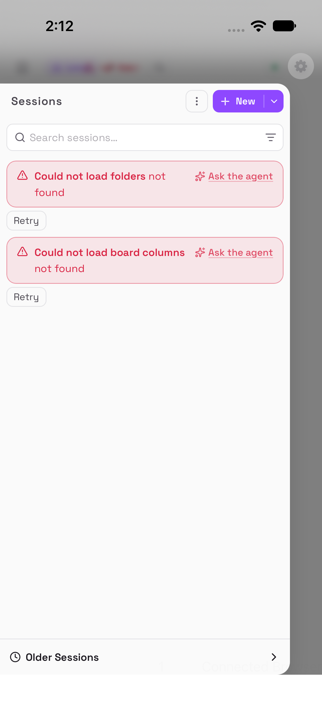
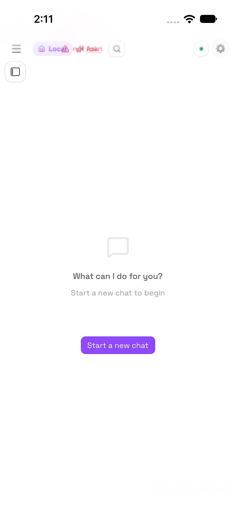
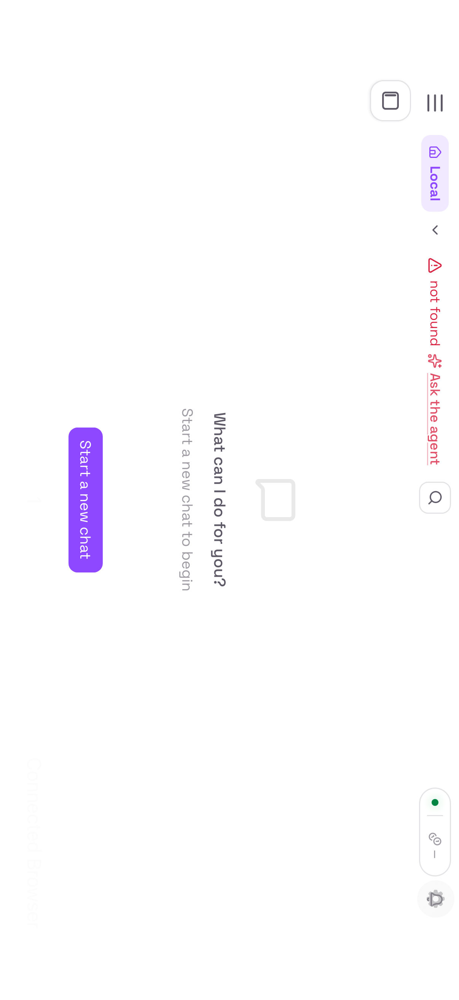

# F5 — The instance chips collide in portrait

| | |
|---|---|
| **Status** | **designed 2026-09-23 — two independent halves: legible chips (A + B) and a native gateway switcher (D)** |
| **Requested** | 2026-09-23, by Olof (bug report): "the list of remotes on the top left isn't really visible on portrait mode phone. Works well on landscape. Not sure if it's fixable since it comes from the dashboard but it affects user experience." |
| **Revision** | one entry when built (numbered then; none is reserved here): the app injects a second stylesheet into the page (B, alongside R2/R22's scripts), and the gateway picker gains a remembered list (D, changes M5's picker) |
| **Touches** | B: `App/Browser` (`PageScriptSources`, `PageScripts`, `BrowserViewModel.loadResolved`), `scripts/test-page-scripts.sh`, the session suite and `testing/harness/fake_gateway.py`. D: `App/Settings`, `App/Workspace/WorkspaceStore.swift`, `App/Discovery`, the discovery suite and `testing/tsnet-harness` |
| **Tracker** | would be issue #1 once the private repos exist; this document is the record until then |
| **Upstream** | `../upstream/kirocrew-portrait-chip-overlap.md` — drafted, **not filed**; Olof authorises filing |

## 1. What is actually wrong (measured, not inferred)

The first spec guessed from the bundle's CSS that the dashboard's **session
sidebar** needs 768 px and so is unreachable at 393 px. **That guess was
wrong.** Driving the real KiroCrew 0.6.0 bundle through the fake gateway on a
402 pt-wide simulator, in both orientations, shows something narrower and more
specific.

**The sessions panel is fine in portrait.** Tapping *Toggle sessions* opens a
proper full-height overlay — header, search field, New button, list, "Older
Sessions" — entirely usable at 402 pt.


**The instance chips are what collide.** The row at the top-left — `Local`, a
remote instance (`⚠ not found` in the harness), `Ask the agent` — overflows its
width in portrait and the labels are drawn **on top of each other**, unreadable:


The same three chips in landscape (874 pt), laid out cleanly, so it is the
width and nothing else. (The screenshot is stored as the device produced it,
rotated.)


So Olof's words were exact: *"the list of remotes on the top left isn't really
visible on portrait mode phone"*. It is the **instance/remote switcher**, not
the session list, and it is an overflowing flex row rather than a hidden
sidebar.

Measured facts, for whoever builds this:
- portrait window 402 × 874 pt, landscape 874 × 402 pt;
- the controls are real accessibility elements in both orientations:
  `Toggle sessions` (36 × 36), `Open menu` (40 × 40), `Switch instance`
  (25 × 24) — so the app **can** drive them, and a test can find them;
- `Switch instance` sits at x = 127 in portrait, inside the colliding row.

### 1a. Read from the bundle during the design pass: one squeeze, two symptoms

The component is `InstanceTabBar` (i18n namespace `instanceTabBar`, strings in
`static/dist/assets/t-DOBS4SB0.js`: `local: "Local"`, `switch_crew: "Switch
instance"`, `instances: "Remote instances"`). Its source is in
`static/dist/assets/App-GOBYv73C.js` (the functions `E8`, `T8`, `nCe`, `w8`,
`QSe` at byte offsets ≈2,925,300–2,937,400) and the header that mounts it at
≈3,370,500. Read together with `assets/src-DcpTXSeK.css` (≈182,100–183,300)
they explain the screenshot exactly:

- The header is a grid, `.topbar{display:grid;grid-template-columns:minmax(0,1fr)
  clamp(240px,22vw,480px) minmax(0,1fr);gap:12px}`, and on phones
  `@media (width<=767px){.topbar{grid-template-columns:minmax(0,1fr) auto
  minmax(0,1fr)}}`. The left cell, `.tb-left,.tb-right{display:flex;min-width:0;
  overflow:hidden;container-type:inline-size}`, therefore gets about half of
  what is left of 402 pt: **≈180 px**.
- Inside `.tb-left` sit the `Open menu` button (`shrink-0`, 40 px) and the bar,
  `<div class="instance-tab-bar-inline flex items-center h-full gap-1 min-w-0"
  role="group" aria-label="Remote instances">`. Inside that, one wrapper
  `div.flex.items-center.gap-1.min-w-0` holds the chip group (`T8`) and, when
  the instances list failed to load, an inline error chip (`ml-2 min-w-0
  truncate max-w-[320px]`, `data-testid="instance-tab-bar-list-error"`, with
  its *Ask the agent* link).
- The chip group's leaves do not shrink: the active `Local` chip is a
  `<button … class="… whitespace-nowrap … shrink-0">` (`w8`), and *Switch
  instance* is a `<button aria-label="Switch instance" class="… h-6 w-6
  shrink-0">` (`QSe`) — the 25 × 24 element the measurement found. Pinned remote
  chips go in `<div data-testid="crew-chip-row" class="crew-chip-row … min-w-0
  overflow-hidden">` (`nCe`), which clips them and sets `data-cut="true"` from a
  `ResizeObserver` (`tCe`).
- The bundle's own degrade ladder for a narrow `.tb-left` is two container
  queries: `@container (width<=152px){.tb-left .tb-drop-crew-name{display:none}}`
  and `@container (width<=128px){.tb-left .tb-crew-active-chip{display:none}}`.
  At 402 pt `.tb-left` is ≈180 px, so **neither rung fires**, while the content
  it must hold — menu 40 + `Local` ≈75 + switcher 24 + gaps — is already ≈150 px
  before a single remote chip.

Two symptoms follow from that one squeeze, and which one the owner sees depends
on whether `GET /api/instances` answered:

1. **Overlap (what the harness shows).** The fake gateway answers `/api/instances`
   with 404, so the error chip renders next to the chip group. Both are `min-w-0`
   flex items of the same wrapper and shrink in proportion; the chip group's
   `shrink-0` leaves then overflow their shrunken box and are painted over the
   error chip. That is the screenshot: `Local`, the chevron and `not found /
   Ask the agent` on top of one another. The component returns nothing at all on
   a **403** (feature disabled), so this needs the list to fail some other way.
2. **Clipping (what a real gateway with the feature on most likely shows).** With
   the list loaded there is no error chip; `Local` and the switcher take their
   ≈100 px and `crew-chip-row` gets what remains — ≈30 px — and clips every
   pinned remote chip to a sliver with a 1 px cut mark. The remotes are then
   "not really visible" in Olof's words: present only in the dropdown behind the
   24 px chevron.

Both are one bug (the bar cannot live in a ≈180 px cell that its own fallback
rules treat as wide) and one rule fixes both (§6). But it means the harness
screenshot is *a* face of the bug and not necessarily Olof's; §11 asks him for
the phone's own.

## 2. What this invalidates

- **The Tailwind-breakpoint theory** (§1 of the previous draft): the 640/768
  bands are real in the bundle but are not what breaks here, and the 861 px
  rules are Excalidraw's. Deleted rather than left to mislead.
- **The decision of 2026-09-23** — "a native session switcher behind the gear" —
  was taken on the wrong premise. A *session* switcher duplicates a panel that
  already works in portrait. What is missing is the **instances** list. The
  choice is therefore back with Olof, re-framed in §3.
- The shared-component argument with F3 survives, but only for the share
  destination picker (F3 needs a session list of its own regardless); it is no
  longer a reason to build a session switcher for F5's sake.

## 3. Options, re-framed around the real bug

**A. Report it upstream (do this regardless).** A chip row whose labels overlap
at 402 pt is a bug in any phone browser, not only in this app, and the
screenshots above are the whole report. Costs nothing, helps every KiroCrew
user on a phone, and is the only fix that lasts without maintenance.

**B. One injected CSS rule, gated to the gateway's origin.** The row is a flex
container that does not wrap; letting it wrap, or scroll horizontally, makes
the chips legible. This is far narrower than the "override the breakpoint" idea
the first draft proposed — it targets one overflowing row.
*Against:* it depends on the bundle's class names, so it can stop applying
silently after an upstream change. Mitigated by a test that fails when it stops
working, and by the fact that failure returns the current behaviour rather than
breaking the page.

**C. Desktop content mode** (`preferredContentMode = .desktop`). Gives the row
the width it wants; shrinks the whole dashboard in portrait. A one-line
experiment worth trying on the phone before committing to B.

**D. A native instance switcher.** The app lists instances itself and switches
between them. **Blocked on a question:** the bundle has remote-instance
management ("Add remote instance", "Configured remote instances"), but whether
there is an HTTP endpoint that lists instances — as `/api/chat/slots` lists
sessions — has not been checked. That check comes first if this is wanted.
Note this is *not* shared with F3: F3 needs a session list, which already works
in portrait.

**E. Nothing in the app.** Rotate the phone. Honest baseline, and what happens
today.

## 4. Decision (2026-09-23)

**Both: A + B, and D.** Olof's answer to the re-framed question was "both", so
this feature has two independent halves that ship separately and neither blocks
the other:

1. **The page is made legible** — upstream report (A) plus the one gated CSS
   rule (B) carried locally until a release includes the fix. This is the floor:
   whatever native UI exists, the dashboard's own chips should not overlap.
2. **The app gains a native instance switcher** (D) — the owner picks a gateway
   from app UI rather than from the page, which also stops the portrait chip row
   being the only way to see *which* instance is selected.

C (desktop content mode) is still worth ten minutes on the phone as a
comparison, but it is no longer a candidate fix: it shrinks the whole dashboard
to widen one row, and D removes the reason to want it.

**D's prerequisite stands:** whether the bundle exposes an endpoint that lists
configured instances is unchecked, and that check is the first task of the
design pass, not an assumption. If there is no such endpoint, D falls back to
the app's own gateway list (which discovery already builds) and the design says
so explicitly rather than inventing an API. **Answered in §5.**

## 5. D's prerequisite, answered from the real bundle: the endpoint exists, and D must not use it

**Yes, there is an endpoint.** `GET /api/instances` is registered in
`kiro_crew/dashboard/routes/connections.py:105` and handled by
`api_instances_list` in `kiro_crew/dashboard/handlers_instances.py:205-242`,
alongside `POST /api/instances`, `PATCH|DELETE /api/instances/{id}`,
`GET …/{id}/status`, `POST …/{id}/connect|refresh-token|disconnect|restart|
send-session`, `GET …/{id}/capabilities` and a catch-all `…/{id}/proxy/{path}`
(`connections.py:104-136`). The dashboard's client calls it as
`listInstances: () => J("/api/instances")` (`static/dist/assets/client-oM83i081.js`,
≈14,386) and the tab bar queries it with `queryKey: ["instances"]` (`E8`).

**What it answers** (`handlers_instances.py:229-241`): `{"active": bool,
"instances": [...], "warm_set_cap": int}`, each instance being the registry
record plus live status (`_instance_view`, `:195-199`). The record is
`Instance.to_dict()` in `kiro_crew/instances/registry.py:283-302`: `id`, `name`,
`ssh_host`, `remote_port`, `local_port`, `ttl`, `remote_bin`,
`connection_method` (`ssh` | `ssm`), `ssm_target`, `aws_profile`, `aws_region`,
`ssm_run_as`, `was_connected`, `forwarder_pid`, `forwarder_start`,
`forwarder_sig`. Status (`_status_for`, `:171-192`) is `{instance_id, state:
"connected" | "connecting" | "error" | "disconnected", error?,
token_ttl_remaining?}`. No token is ever in the list (`:13-15`).

**Who may ask** (`_guard`, `:121-148`): a request from the Slack path → 403; no
authenticated owner (`request["user"]` unset) → 401; `instances.enabled` false
in the gateway's config → 403 "instances feature is disabled". The feature is
**off by default** — `InstancesConfig`, `kiro_crew/config/sections.py:4593-4604`:
"Off by default — opt-in only, since enabling it allows the gateway to open SSH
`-L` forwards and relaxes the dashboard CSP `frame-src` for the active loopback
tunnel ports."

**What an "instance" is, and why the app cannot use it.** A KiroCrew instance is
a *remote* KiroCrew gateway that *this* gateway reaches by opening an SSH (or
AWS SSM) tunnel bound to its own loopback: `ssh -N -L 127.0.0.1:LP:127.0.0.1:RP
<ssh_host>` (`kiro_crew/instances/ssh_tunnel_manager.py:9`, `_LOOPBACK =
"127.0.0.1"` at `:143`, "loopback-bound" at `:353`). The dashboard then shows
the remote dashboard in an **embedded iframe whose `src` is**
`` `http://${window.location.hostname}:${port}/?token=${encodeURIComponent(token)}` ``
(`App-GOBYv73C.js` ≈2,944,889, the `instancesViewport` component), the CSP
`frame-src` being widened with a loopback wildcard for the purpose
(`kiro_crew/dashboard/server.py:1085-1087`). Switching instances in the page is
therefore *not* a navigation to another origin: it is a same-origin UI state
change that shows a **plain-HTTP, cross-origin frame on the gateway's own
loopback port**, and `connect` (`:594`) mints a token so that frame can set its
cookie. From a phone that frame is dead three times over, and each is an
invariant this project keeps on purpose:

1. the tunnel listens on the gateway's `127.0.0.1`; nothing on the tailnet can
   reach it (network fact, not app policy);
2. it is `http://`, which ATS refuses with no exceptions (R28);
3. it is another origin, which F6's rule list blocks as a cross-origin frame
   (`F6 §4`), and which R3 would keep out of the main frame anyway.

So the page's own instance switcher is a desktop feature by construction. A
native switcher built on `/api/instances` would list things the phone can
never show, behind a feature most gateways have off (403), and would need the
page's cookies to ask at all. **D does not use it.**

**What D lists instead: the app's own gateways.** The app's notion of "switch
instance" is *another KiroCrew gateway on the tailnet* — exactly what
discovery already enumerates (`App/Discovery/GatewayDiscovery.swift`) and what
`Workspace.selectGateway(_:)` (`App/Workspace/Workspace.swift:159-165`) already
switches to, with the session reset and the page reopened at the new origin.
D is that, made fast (a remembered list, so switching does not wait on a
12-second sweep) and visible (the current gateway named, the others' reachability
shown). If Olof's remotes are tailnet machines serving their own dashboards,
discovery finds them and D switches to them directly; if they are reachable
only through the hub's SSH tunnels, no phone client can show them without
weakening 1–3 above, and this spec does not try (§11 asks which it is).

A later refinement, deliberately out of scope: where the feature *is* enabled,
`/api/instances` could seed discovery with candidate names (`name`, `ssh_host`).
It would need a page-world fetch (cookies, R21's pattern) and helps only when
those names are tailnet peers. Not built until someone wants it.

## 6. Design — half one: the page made legible (A + B)

**A. Upstream report.** Drafted at `../upstream/kirocrew-portrait-chip-overlap.md`
to the standard of the fonts report (KiroCrew#13161), with the two screenshots
as evidence and the cause named from the bundle's own CSS and markup. Not filed:
Olof runs `gh` for it, or authorises it as he did for #13161.

**B. One gated rule, carried locally.** The fix has to hold both faces of the
bug (§1a): the chip group's leaves must stop being squeezed into overlap, and
the pinned chips must stop being clipped to nothing. Making the inline bar a
horizontal strip that scrolls, with content that keeps its natural width, does
both, hides nothing, and leaves every width where nothing overflows exactly as
it is:

```css
@media (width <= 767px) {
  .tb-left > .instance-tab-bar-inline[role="group"] {
    overflow-x: auto;
    overscroll-behavior-x: contain;
    scrollbar-width: none;
  }
  .tb-left > .instance-tab-bar-inline[role="group"] > div {
    flex-shrink: 0;
  }
}
```

Why each piece:

- **The media query is the bundle's own phone breakpoint** (`(width<=767px)`,
  the one that switches `.topbar` to the mobile grid). In landscape at 874 pt
  the header lays out in its desktop grid and this text is inert, so "landscape
  unchanged" is true by construction, not by luck.
- **The selector is the real markup**: `.tb-left` (the header's left cell,
  styled in `src-DcpTXSeK.css`) → its direct child `.instance-tab-bar-inline`
  (the class `C8("inline")` emits; no stylesheet rule uses it, so it is a
  marker, which is what makes it a good hook) with `role="group"` (the
  accessibility contract the *Remote instances* label rides on). Three
  independent facts must all hold for it to match; any upstream change to one
  of them makes the rule a no-op.
- **`overflow-x: auto` on the bar** turns the `min-w-0` flex item into a scroll
  container of the width `.tb-left` gives it. **`flex-shrink: 0` on its one
  wrapper child** stops that wrapper — and so the chip group, the chip row and
  the error chip inside it — from being squeezed below their content width.
  The leaves keep their `shrink-0`; nothing overflows a box any more, because
  the boxes are as wide as their content and the bar scrolls instead. The
  chip row's `ResizeObserver` then sees no clipping and stops writing
  `data-cut="true"`.
- **What the owner gets:** `Local` and the `Switch instance` chevron where they
  are today, legible; remote chips (or the error chip) laid out in a row to the
  right, the first partly visible, the rest one swipe of the strip away. The
  dropdown behind the chevron still lists everything, as today.
- **Nothing else is touched.** The sessions panel, the search button, the right
  cell's status capsule and every element outside `.tb-left` are outside the
  selector. The bundle's own container-query rungs stay in place beneath.

**How it fails, on purpose.** If a future bundle renames or restructures any of
`.tb-left`, `.instance-tab-bar-inline`, `role="group"` or the single wrapper
child, the rule matches nothing and the page is exactly today's page — never a
broken one. The session-suite test in §9 fails in that case (frames overlap
again), which is how the silent expiry of the rule is noticed. If the bundle
reuses the class for something else, the `@media` gate confines any effect to
phone widths and the two declarations are the mildest possible (a scroll
container and an unshrinkable child): no `display`, no `position`, no sizes.

**How it is injected, next to R2, R22 and F6.**

- `App/Browser/PageScriptSources.swift` gains `chipRowStyle(origin:) -> String`
  (source text only, host-testable like the others) and the constant
  `chipRowStyleID = "latchkey-chip-row"`. The script follows the session
  bridge's precedent exactly (`sessionBridge`, `:82-100`): at document start,
  create one `<style id="latchkey-chip-row">` with the text above and append it
  to `document.head || document.documentElement`; do nothing if the element
  already exists; everything inside `try`, because a failure here must leave
  the page as it was.
- **Origin gate, baked in:** the script's first line is `if (window.location.origin
  !== "<origin>") return;`, with the origin string substituted by the app —
  the same `GatewayAddress.origin(of:)` value R3's `allowedOrigin` is set from,
  so the gate and R3 agree by construction. It is redundant with R3 (the main
  frame can only ever show that origin) and kept because F6 promised the same
  gate and because it costs one string compare. An origin is
  `scheme://host[:port]` and cannot contain a quote, so plain substitution is
  safe; the host test pins that.
- **`App/Browser/PageScripts.swift`** gains `chipRowStyle(origin:)` building the
  `WKUserScript`: `.atDocumentStart`, `forMainFrameOnly: true` (R3's rule: the
  dashboard's `/sandbox-doc/` frames are none of the app's business), in
  `WKContentWorld.defaultClient` — the app's isolated world, so the page cannot
  see or call the function; the `<style>` it appends is DOM and applies
  regardless of world.
- **Where it is installed:** `BrowserViewModel.loadResolved(_:)`
  (`App/Browser/BrowserViewModel.swift:361-373`), **once per web view**, at the
  first app-initiated load — the point where `allowedOrigin` is decided. A
  `private var chipRowStyleOrigin: String?` guards against a second add on the
  sign-in navigation (`loadSessionURL`) and the startup retries. A user script
  added before `webView.load` runs on that load. Installing in `makeWebView()`
  with `initialURL` would work for the picker-chosen FQDN origins M5 writes, but
  a bare name typed in Settings is qualified in `loadInitial` and the baked
  origin would then miss; `loadResolved` sees the qualified one.
- **Not `removeAllUserScripts()`**, ever: the M1 cleanup entry in
  `../DECISIONS.md` records that call wiping R2's and R3's scripts. Every
  installer here only adds.
- **A gateway switch (D, or the picker)** goes through `reopenHomeTab()`
  (`App/Browser/TabManager.swift:138-143`): a new `BrowserTab`, a new
  `BrowserViewModel`, a new `WKWebView` and configuration. The style is built
  again for the new origin on its first `loadResolved`. Nothing to replace.
- **Relative to F6:** F6 installs its `WKContentRuleList` and its marker
  `WKUserScript` on the same `userContentController` (F6 §4, §4a). They do not
  meet: F6's rule list filters network loads and this is not one; F6's script
  runs in the page world and sets `data-kiro-blocked` on images, this one runs
  in the client world and adds a `<style>`; the two stylesheets have different
  element ids (`latchkey-chip-row` vs F6's) and disjoint selectors
  (`.tb-left > .instance-tab-bar-inline…` vs `img[data-kiro-blocked]`), so
  order of addition is irrelevant. Whichever lands first changes nothing for
  the other. Both are marked as the fragile, bundle-dependent parts of their
  features, and both fail the same way — back to today's page.

**Invariants this must not break** (see `../../app/AGENTS.md`): the split
tunnel is untouched (no network call is added); `allowFailover` stays false;
ATS stays on with no exceptions; D1 holds (nothing here writes a log line with
page content; the one new line is "Chip-row style installed for <origin>",
an origin the log already carries); the vendored tree is not touched.

## 7. Design — half two: the native gateway switcher (D)

**Where it lives: behind the gear**, in Settings — Olof's placement from the
first decision survives even though the thing behind it changed. Settings
already has the gateway section with a *Find gateways* sheet
(`App/Settings/SettingsView.swift:157-173`, `viewModel.choose(origin)`); D
grows that section rather than adding chrome over the page. No new floating
control: the gear (`DashboardRootView.swift:317-331`) stays the one piece of
app chrome, and the page's own bar is not hidden or replaced.

**What it shows.** Settings → **Gateway**, top of the sheet:

- **Current** — the chosen gateway, `host` or `host:port` (F1's rendering rule),
  monospaced, with a check mark. `accessibilityIdentifier("gateway-current")`.
- **Known gateways** — every gateway this workspace has ever loaded, most recent
  first, at most 8, minus the current one. Each row: name as above, a status
  line, one tap to switch. Rows `gateway-switch-<host[:port]>`, status
  `gateway-switch-status-<host[:port]>`. Swipe to delete (`gateway-forget-…`).
- **Found on the tailnet** — gateways the sweep found that are not known yet,
  same row shape (`gateway-found-<host[:port]>`).
- **Find gateways…** — opens the existing `GatewayPickerView` (sweep, manual
  entry, the M5 review's tailnet check on typed names), unchanged.

**Where the list comes from** (§5): the app, not the gateway.

- `WorkspaceDefinition` (`App/Workspace/WorkspaceStore.swift:54-66`) gains
  `var knownGateways: [String]?` — **origins only**, `https://host[:port]`, as
  `GatewayAddress.origin(of:)` produces them, never a path or a query (R2: a
  pasted sign-in link must not leave a token in `workspaces.json`).
- `Workspace.selectGateway(_:)` (`Workspace.swift:159-165`) moves the origin to
  the front of the list, capped at 8, before `setHomePage`; the existing
  `onChange?(definition)` observer persists it. `forgetGateway(_:)` removes one.
- Reachability comes from **the sweep the app already runs**:
  `GatewayDiscovery.start(savedHost:)` on the section's appearance (the
  picker's `sweepOnAppear` semantics, `GatewayPickerView.swift:129-132`), cancelled
  on disappearance (`:140`), the current gateway probed first as R26 requires.
  While `phase == .probing` every known row reads "checking…"; when it is
  `.finished`, a known gateway in `discovery.gateways` reads "answering", one
  that is not reads "not answering", and `.proxyUnhealthy` shows the picker's
  own line ("The tailnet connection isn't passing traffic yet"). R39's budgets
  bound the wait (4 s per probe, 12 s per sweep); F1 doubles the probes and
  the budgets already have room.
- A known gateway whose host **is no longer a tailnet peer**
  (`model.proxyPolicy?.matchingRule(for: host) == nil`, the same test the
  picker applies to typed names at `GatewayPickerView.swift:163-166`) reads
  "not on this tailnet" and its row is **disabled**: selecting it would load
  direct, off the tailnet, and make that origin the sign-in origin. That is the
  M5 review's rule, kept. It can still be forgotten.

**What happens on selection.** `viewModel.choose(origin)` →
`workspace.selectGateway(origin)`, the path the picker uses today, then
Settings dismisses so the owner sees the page. In order, and each is existing
behaviour this design relies on rather than adds:

1. `HomePage.url` becomes the new origin (persisted; F1: with its port).
2. `session.reset()` — the old gateway's sign-in state means nothing for the new
   one (M5). F1 keys `SessionManager` by origin, which this needs: two gateways
   are two sessions.
3. `tabManager.reopenHomeTab()` — the old web view is unloaded, a new one is
   created for the new origin. Consequences that follow automatically:
   - **R3:** the new view model's first `loadResolved` sets `allowedOrigin` to
     the new origin; nothing else may show in the main frame.
   - **F6:** the rule list is compiled and installed for the new host before
     the first load (F6 §4: "replaced when the gateway changes"; its identifier
     carries the host, so a switch never reuses a stale list). `unless-domain`
     matches a host regardless of port, so a host-keyed list is also right for
     F1's `host:8443`; F6 need not key by port.
   - **B:** the chip-row style is built for the new origin (§6).
   - **F1:** the origin carries the port; `Gateway.id` is `host:port`, so the
     same host on two ports is two rows here as in the picker.
4. **Cookies stay.** The workspace has one `WKWebsiteDataStore`; cookies are
   host-scoped, so switching *back* finds the earlier gateway still signed in
   and the sheet does not reappear. This is the point of a switcher and it is
   asserted (§9). Sign-out (R32) still clears the whole store, all gateways.
   Two ports on one host do **not** share a cookie name: KiroCrew names its
   cookies after the port in the `Host` header, falling back to its own
   listen port only when the header carries none — so `mc_token_5476` behind
   serve on 443 (R37's case) and `mc_token_8443` behind serve on 8443 (F1
   §4.6, which retracted its earlier "same name" draft). `host:443` and
   `host:8443` therefore do not sign each other out. WebKit still scopes
   cookies by host, so each origin is sent the other's cookies and ignores
   them, and `SessionCookies.summaries(of:host:)` groups by the name's port
   suffix (`app/App/Diagnostics/SessionCookies.swift:44-49`) so Status shows
   one line per port. The picker shows two rows for the two ports either way.
5. **F4 tells the truth about the new gateway.** A load in flight shows
   `page-connecting` with the host named; a dead one ends in `nav-error-overlay`
   with `nav-error-choose-gateway` (F4 §4), which opens the picker; a host that
   is not a peer shows `home-page-warning-banner` (`DashboardRootView.swift:348-351`)
   with *Find* and *Change*. D adds **no state of its own** after selection: an
   unreachable instance is shown by the states that already exist for exactly
   that, and the switcher's own "not answering" line is a forecast, not a gate
   — a gateway asleep a minute ago may answer now, so the row stays tappable.

**What D is not.** Not the page's instance switcher (§5); not F3's session
picker (F3 needs `/api/chat/slots`, a different list); not a probe on tap (one
sweep on appearance is the budgeted cost, and F4 reports the outcome of the
real load); not a per-gateway settings screen (F1 §3).

**Invariants this must not break**: the split tunnel decides what is proxied,
and a disabled row is how a non-tailnet origin is kept out of it;
`allowFailover` stays false; ATS stays on; D1 holds (`knownGateways` never
leaves the device; the log line "Gateway chosen: <origin>" already exists); no
vendored-tree change.

## 8. State and migration

- **B persists nothing.** The `<style>` is per document, rebuilt on every load.
- **D persists `knownGateways: [String]?` in `workspaces.json`.**
  - Written by the previous version: the key is absent → decoded as `nil`,
    treated as `[]`; the list is seeded with the current `homePageURL`'s origin
    on first use, so an upgrade shows one known gateway, the current one.
    Declared optional precisely so the existing `Codable` synthesis keeps
    reading old files without a custom `init(from:)`.
  - Read by an older build: an unknown key is ignored by the synthesised
    decoder; a downgrade loses the list and nothing else.
  - Contents: origins only, ≤ 8, no ordering beyond most-recent-first. A
    reset (R32 "delete this workspace") deletes the file and the list with it.
- Backup exclusion (R5) is unchanged: `workspaces.json` holds an origin today
  and holds a few more after this; nothing secret is added.

## 9. End-to-end tests

Suites: **host** is `make -C app test-policy` (`app/scripts/test-page-scripts.sh`
runs the exact injected text under Node, as it does for R2's and R22's
scripts); **L1** is `scripts/test-offline.sh` (`UITests/OfflineHarnessTests.swift`,
the fake dashboard and stub proxy); **session** is `scripts/test-session.sh`
(`UITests/SessionTests.swift`, the real 0.6.0 bundle through
`testing/harness/fake_gateway.py`); **discovery** is `scripts/test-discovery.sh`
(`UITests/DiscoveryTests.swift`, the L2 harness). The simulator suites are not
run during the design pass.

**Finding the chips.** In the session suite the bar is the element labelled
`Remote instances` (`role="group"`, `aria-label`), matched by label whatever
XCUITest types it (`app.webViews.descendants(matching: .any).matching(NSPredicate(
format: "label == 'Remote instances'"))`). The chips are its descendants with a
non-empty label of type `.button`, `.link` or `.staticText`: `Local dashboard`
(the `Local` chip's `aria-label`), `Switch instance`, and in the error case the
`not found` text and the `Ask the agent` link; in the pinned case
`<name> (<host>) — <state>`. **Disjoint** means `frame.intersection(other).isEmpty`
for every pair, after insetting each frame by 1 pt so a shared edge is not an
intersection. **In a row** means every chip's `midY` is within 3 pt of the
group's `midY`.

**Rotation.** `XCUIDevice.shared.orientation` is set after `launch()` and after
the `Toggle sessions` button exists, never before the app has a window. After
setting it the test waits until `app.windows.firstMatch.frame.width` is greater
than its height (landscape) or less (portrait), up to 5 s, then waits until
the group's frame is unchanged across two reads 300 ms apart — the header's
`ResizeObserver` and the grid relayout run after the rotation, and an
assertion taken in the first half-second sees a frame from either side of it.
`setUp` and `tearDown` both set `.portrait`: the suite runs its tests serially
in one simulator, and a test that fails while landscape would otherwise hand
the next test a rotated device, the classic source of a flaky green-then-red
run. Nothing is asserted from a screenshot.

**The fake gateway grows one optional stub for the pinned case.** Today
`GET /api/instances` falls through to 404 (`fake_gateway.py:651-653`) and is
listed under `unknown` in `/__state`; that stays the default, so every existing
test and the overlap test see today's page. `POST /__config?instances=2` makes
it answer `{"active": true, "instances": [two records with was_connected: true,
status.state "disconnected"], "warm_set_cap": 5}`; `POST …/connect` keeps
answering 404, which the page tolerates (its warm-set loop swallows the error).
The two names are placeholders (`crew-a`, `crew-b`), never real machine names.

| Test | Suite | Asserts | Shown to fail by |
|---|---|---|---|
| **The instance chips do not overlap in portrait** | session, real bundle | portrait, list failing as today: every chip pairwise disjoint, in a row, inside the window; `Local dashboard` and `Switch instance` hittable | **today's build**: `Switch instance` at x ≈ 127 lies inside `Local dashboard`'s frame, so the intersection is non-empty — the measured bug as it stands |
| Pinned remote chips are reachable in portrait | session, real bundle, `__config?instances=2` | after pinning both remotes through the page's own menu (`Switch instance` → `Pin crew-a`, `Pin crew-b`; `role="menuitemcheckbox"`, matched by label), each remote chip is disjoint from the others, in the row, and hittable after at most one slow `swipeLeft()` on the group; `data-cut` is not something XCUITest can read, so hittability is the assertion | today's build: the chips are clipped to ≈30 px and never hittable, swiped or not. Run against today's build first; if it does not fail there, this row is dropped, not kept green |
| Landscape is unchanged | session, real bundle | in landscape the same chips are disjoint, in one row, inside the window, and the group's height is one row (every chip's `midY` within 3 pt of the group's) | temporarily replacing the injected text with `.tb-left > .instance-tab-bar-inline[role="group"]{display:block}` at every width: the chips stack and the row test fails |
| The sessions panel still works in portrait | session, real bundle | portrait: `Toggle sessions` opens the panel; the `Search sessions…` field and the *New* button exist and are hittable | temporarily widening the selector to `.tb-left, [role="dialog"]` with `display:none`: the panel never appears |
| The style is gated to the gateway's origin | host (`test-page-scripts.sh`) | the exact text, run under Node against a fake `window`/`document`: with `location.origin` equal to the baked origin, one `<style id="latchkey-chip-row">` is appended whose text contains `(width <= 767px)`, `.tb-left > .instance-tab-bar-inline[role="group"]` and `flex-shrink: 0`; run twice, still one element; with any other origin, nothing is appended; an origin containing a quote is refused by the Swift side before substitution | dropping the origin compare (the foreign-origin case appends); dropping the id check (two elements) |
| The style reaches the real DOM on the gateway | L1 offline | the fake dashboard's page writes `document.getElementById('latchkey-chip-row') !== null` into a stable element (`#latchkey-style-present`, as `dashboard.py` already does for its WebSocket state); XCUITest reads `true` | not installing the script (reads `false`); this is the positive control for the row above |
| A gateway switch keeps every injected script | L1 offline | after `Change` → a second gateway (a second fake dashboard peer) the token is still stripped (R2's test, re-run against the new origin) and `#latchkey-style-present` is `true` there | an installer that calls `removeAllUserScripts()` |
| **The switcher lists the current gateway and switches to another** | discovery (L2) | with two gateway peers (`gw`, and `gw2` served by a second `fake_gateway.py` instance; or F1's `gw-alt` if it lands first): Settings shows `gateway-current` = `gw…`, `gateway-switch-gw2…` with status "answering" within R39's budget; tapping it logs `Gateway chosen: https://gw2…`, and **the second fake's journal records the page load** (server-side evidence) | today's build: no `gateway-switch-*` row exists |
| Switching back needs no new sign-in | session, real bundle (two fake instances) | sign in on `gw`, switch to `gw2` (the sheet appears there), switch back to `gw`: no `token-sheet`, `redemptions` unchanged on `gw`, `auth_me_ok` on `gw` increased | clearing web data on switch (the sheet reappears, a second redemption) |
| A gateway that does not answer is labelled, and F4 shows the failure | discovery (L2) | a known gateway pointed at the harness's dead peer reads "not answering" once the sweep finishes, stays tappable; tapping it shows `page-connecting` naming the host, then `nav-error-overlay` with `nav-error-choose-gateway` | removing the status line; or gating the tap on the status (the row is disabled and F4 never runs) |
| A non-tailnet known gateway cannot be selected | discovery (L2) | a `knownGateways` entry for a host that is not a peer in the fixture reads "not on this tailnet", is disabled, and the proxy journal shows **no connection attempt** to it | dropping the `matchingRule` check: the row is enabled and a tap loads it direct |
| Known gateways survive a relaunch and an old file | discovery (L2) + host | after choosing two gateways and relaunching without reset, both rows are back in most-recent-first order; a `workspaces.json` without the key (host test on `WorkspaceStore` decoding, `scripts/test-workspace-store.sh`, new) decodes with an empty list; a list of 9 is written as 8 | writing the list only in memory; making the field non-optional (the old file fails to decode) |
| Nothing new is fetched over plain HTTP, nothing leaves the tailnet | L1 offline | the existing anti-leak counts stay zero through a switch between the two fake peers | an origin stored with `http://` (must fail) |

## 10. Acceptance criteria

- **Portrait legibility (B):** on the real 0.6.0 bundle at 402 pt, every
  instance chip's frame is disjoint from every other's and inside the window,
  and `Local dashboard` and `Switch instance` are hittable. Instrument:
  `SessionTests` frames, enforced by `scripts/test-session.sh`; the test fails on
  today's build.
- **Pinned remotes reachable (B):** with two remotes pinned, each chip is
  hittable after at most one swipe of the strip. Instrument: the same suite
  with `__config?instances=2`.
- **Landscape untouched (B):** at 874 pt the chips are in one row, disjoint,
  inside the window. Instrument: the same suite, after `XCUIDevice.shared.orientation`.
- **The rule is one gated stylesheet (B):** the injected text is the text in
  §6, contains the bundle's phone breakpoint and the full three-part selector,
  is appended once, and only on the gateway's origin. Instrument:
  `scripts/test-page-scripts.sh` in `make test-policy`, plus L1's
  `#latchkey-style-present`.
- **Failure degrades to today (B):** with the selector made to match nothing
  (a renamed class in a copy of the bundle served by the fake), the page is
  today's page — the overlap test fails and nothing else does. Instrument: the
  session suite against the altered copy, run once during the build and
  recorded in §12.
- **A native switch is two taps and honest (D):** gear → a known gateway row;
  the row shows "answering" or "not answering" from the sweep within R39's
  budget (first result ≤ 5 s, sweep ≤ 15 s), and the switch is proven by the
  target gateway's journal and the app's `Gateway chosen:` line. Instrument:
  `scripts/test-discovery.sh`, which already reads the R26 sweep line.
- **Switching back keeps the session (D):** no sheet, no redemption.
  Instrument: the fake gateway's `/__state` counters.
- **Nothing off-tailnet is ever loaded (D):** a non-peer known gateway is
  disabled and the proxy journal shows no attempt. Instrument: the stub proxy's
  `/journal`.
- **On the device:** in portrait the chips are legible; Settings → Gateway
  lists the two gateways used so far with their status, and switching between
  them does not ask for a token twice. Recorded in `../DEVICE-CHECK.md`.

## 11. Open questions and owner actions

- ~~the decision of 2026-09-23 answered the wrong question; what is wanted
  instead?~~ **Answered 2026-09-23: both** (see §4).
- ~~Is switching instances from the phone something you actually do?~~ Answered
  by "both": the native switcher is wanted, so assume yes.
- ~~Does the bundle expose an endpoint listing configured instances?~~
  **Answered in §5: yes, `GET /api/instances`, and D must not use it** — what it
  lists is shown in a loopback-bound plain-HTTP frame that no phone can reach.
  D uses the app's own gateway list.
- **Olof: which face of the bug does your phone show?** A screenshot of the
  dashboard header in portrait on the real gateway settles whether it is the
  overlap (the list failed) or the clipping (the list loaded, the remotes cut
  off); §1a explains why both are the same bug and the same fix, but the
  upstream report is stronger with the real one attached.
- **Olof: are your remote instances tailnet machines running their own
  `tailscale serve` dashboard**, or reachable only through the hub's SSH tunnel?
  The first is what D switches between. The second no phone client can show
  without a plain-HTTP, cross-origin, loopback frame — and this spec does not
  weaken ATS, R3 or F6 to try.
- **Upstream:** file `../upstream/kirocrew-portrait-chip-overlap.md` with the
  two screenshots (and the phone's, if it comes). Second report after the fonts
  one (KiroCrew#13161). Olof runs `gh` for it, or authorises it as before.
- **Build order:** B shares `App/Browser` with F6 and the session suite with F1;
  D shares `App/Discovery` and the discovery suite with F1. Neither half of F5
  depends on the other or on F1/F6 landing first; the F1 `gw-alt` peer merely
  saves the discovery suite a second fake instance if it exists by then.
- Should C (desktop content mode) still get its ten minutes on the phone? Only
  as a comparison for the report; it is not a candidate.

## 12. Log

- 2026-09-23: reported; first diagnosis (session sidebar behind a 768 px
  breakpoint) written from the bundle's CSS.
- 2026-09-23: **measured against the real bundle and the diagnosis was wrong.**
  The sessions panel is fine in portrait; the instance chips overlap. Options
  re-framed, the earlier decision invalidated, screenshots kept in
  `f5-measurement/`. The measurement was a throwaway XCUITest, deleted after
  the run; what it established is above.
- 2026-09-23: **Olof's call on the re-framed question: both.** The page gets
  made legible (A + B) *and* the app gets a native instance switcher (D), as two
  independently shippable halves. Design pass opened; its first task is the
  instance-endpoint check that D rests on.
- 2026-09-23: **design pass.** The endpoint exists (`GET /api/instances`,
  `routes/connections.py:105`, `handlers_instances.py:205`) and is exactly the
  reason D must not use it: off by default, owner-gated, and what it lists is
  shown in an `http://<host>:<loopback port>` iframe. The chip row read from the
  bundle: `.tb-left` ≈180 px at 402 pt, `min-w-0` wrappers with `shrink-0`
  leaves, container-query rungs at 152/128 px that never fire — one squeeze,
  two symptoms (overlap with the error chip, clipping without it). The CSS half
  is one gated rule on `.tb-left > .instance-tab-bar-inline[role="group"]`;
  the native half is the app's own remembered-plus-discovered gateway list in
  Settings. Upstream duplicate check by `gh search issues` (single terms:
  instances, tab bar, overlap, portrait, topbar, remote instance, chip): nothing
  on this; near misses #8175 (same bar, desktop, collapses when a remote pane is
  focused), #7698 (the same mobile top-bar degrade ladder, a different rung —
  a useful precedent), #9581 (topbar error surfaces). Report drafted, not filed.
